import Figure from '../../src/components/Figure'

# Colors

The color system handles the variability of dynamically changing color schemes that arise as user inputs change.
The logic of tonal relationships and shifts in hue and chroma provide a foundation for flexible color application.

## Key colors

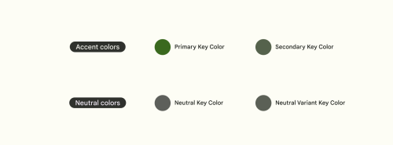

The foundation of a color scheme is the set of five key colors that individually relate to separate tonal palettes with 13 tones. Specific tones from each tonal palette are assigned to color roles across a UI.

Key colors are the foundation for creating any dynamic color scheme. With key colors established, Material’s algorithm specifies the full spectrum of colors needed for expressing interaction states, errors, and accessible contrast.

Custom colors can be added to a scheme as well.

### Accent colors

The **primary key color** is used to derive roles for key components across the UI, such as prominent buttons and active states.

The **secondary key color** is used for less prominent components in the UI such as chips, while expanding the opportunity for color expression.

### Typography and iconography colors: "On" colors

App surfaces use colors from specific categories in your color palette, such as a primary color. Whenever elements, such as text or icons, appear in front of those surfaces, those elements should use colors designed to be clear and legible against the colors behind them.

This category of colors is called **“on” colors**, referring to the fact that they color elements that appear “on” top of surfaces that use the following colors: a primary color, secondary color, surface color, or error color. When a color appears “on” top of a primary color, it’s called an “on primary color.” They are labelled using the original color category (such as primary color) with the prefix “on.”

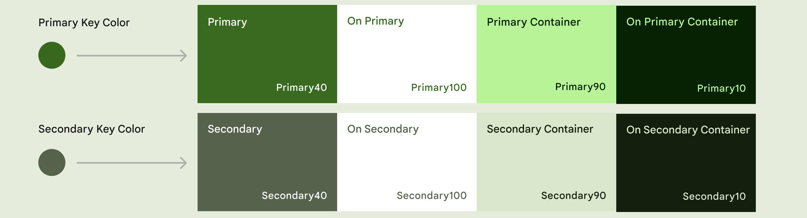

### Neutral colors

The neutral key color is used to derive surface color roles for backgrounds, as well as colors used for high emphasis text and icons.

The neutral variant key color is used to derive color roles for medium emphasis elements like text, icons, and component outlines.

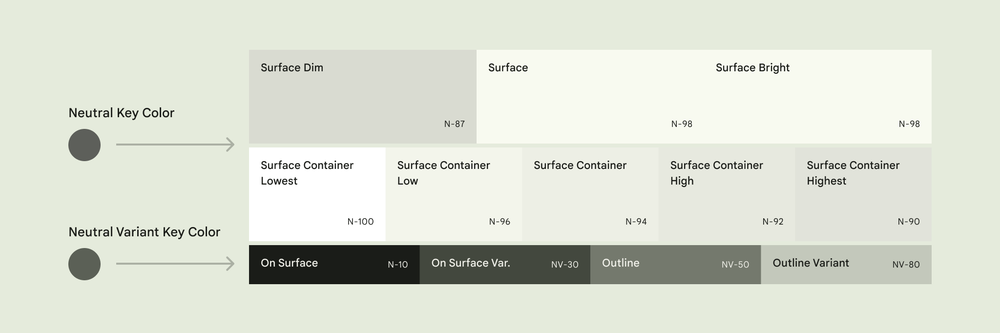

### Error colors

In addition to the accent and neutral key color, the color system includes a semantic color role for error, again in the form of the error role itself, plus an on-error, error container, and on-error container role.

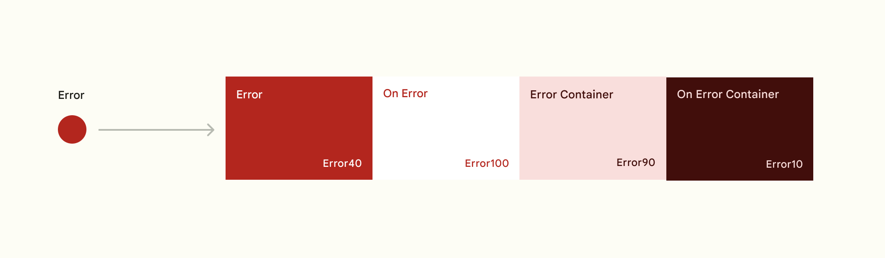

### Warning colors

The color system also includes a semantic color role for warnings, again in the form of the warning role itself, plus an on-warning, warning container, and on-warning container role.

### Success colors

The color system also includes a semantic color role for success, again in the form of the success role itself, plus an on-success, success container, and on-success container role.

## Tonal palettes

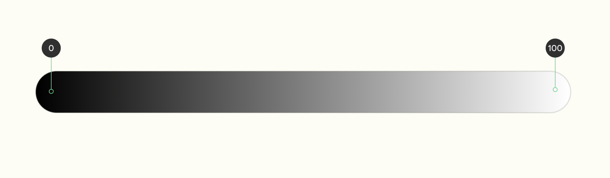

The 100 tone is always 100% white, the lightest tone in the range; the 0 tone is 100% black, the darkest tone in the range

### One key color becomes thirteen tones

A tonal palette consists of thirteen tones, including white and black. A tone value of 100 is equivalent to the idea of light at its maximum and results in white. Every tone value between 0 and 100 expresses the amount of light present in the color.

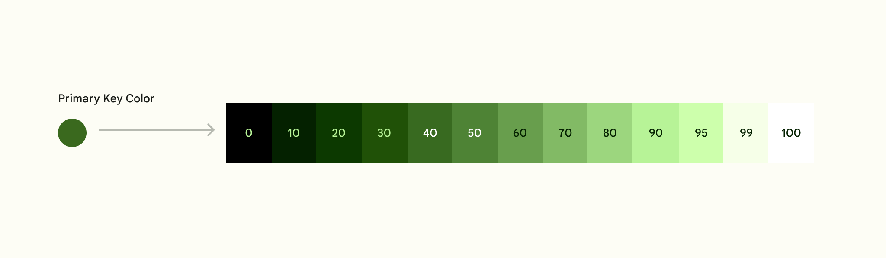

The **neutral palette** exceptionally contains 18 colors (5 additional colors).

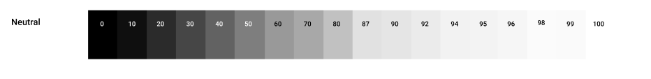

:::tip
See [color palettes tokens](../reference-tokens#palettes).
:::

## Color roles

While key colors are the basis for tonal palettes, only a selection of the thirteen colors from each tonal palette are used in a UI.

A primary color’s tonal palette, for example, defines tones for paired roles such as the colors for text and icons that are placed on top of a component (On primary). The tone pairings in color roles provide accessible contrast by default and inform tone adjustments for any additional custom color to work harmoniously.

Each key accent color (primary, secondary) and custom color (error, warning and success) is provided as a group of 4 compatible colors with different tones that can be applied for differing emphasis and visual expression, and paired for visual contrast.

Primary is used here as an example:

- **Primary** base color
- **On-Primary** is applied to content (icons, text, etc.) that sits on top of primary
- **Primary container** is applied to elements needing less emphasis than primary
- **On-primary container** is applied to content (icons, text, etc.) that sits on top of primary container

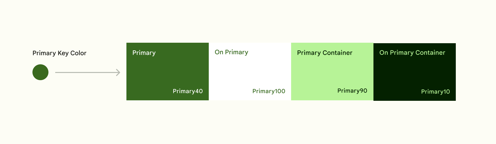

Neutral key colors are to provide similar groups of colors for Surfaces and Outlines.

By mapping and coding roles through tokens, rather than assigning hex values, a color can update systematically if a color palette changes. Tokens enable changes to a role's color value to cascade consistently.

<Figure
    src={require('./img/all-color-roles.png').default}
    alt="All Color Roles"
    caption="From key colors, roles are automatically assigned roles that map to theme components"
/>

:::tip
See [color roles tokens](../system-tokens#color).
:::

### Surfaces

**Surface colors** are used for backgrounds and contained areas. There are three core surface roles: surface dim, surface, and surface bright.

**Surface container** is the recommended default color for a contained area against the surface color. It provides good contrast and can be flexibly combined with all other higher or lower emphasis surface roles.

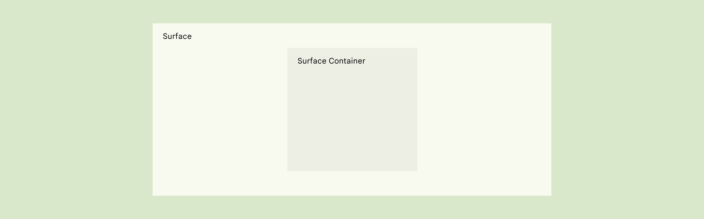

In this example, the area of primary focus is using the surface role, while the navigation area is using the surface container role.

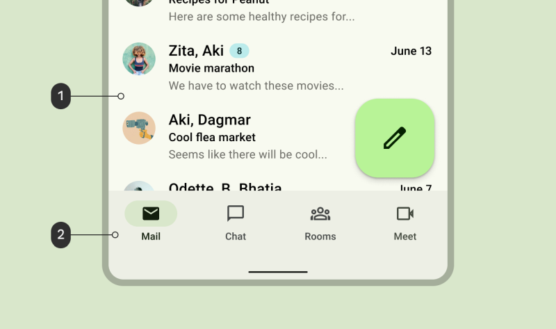

:::tip
See [surface tokens](../system-tokens#surfaces).
:::

### Outlines

Outline is a utility color that creates boundaries and emphasis to improve usability. The outline color has a 3:1 contrast with all surface colors.

Outline variant is a utility color that creates boundaries for decorative elements when a 3:1 contrast isn’t required, such as for dividers or decorative elements.

<Figure
    src={require('./img/outline-roles.png').default}
    alt="Outline Roles"
    caption="Outline and Outline Variant roles in the color scheme"
/>

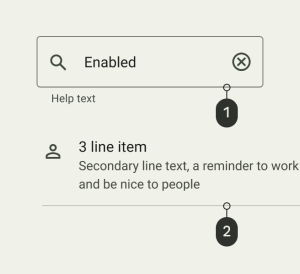

- **1**: A text field which uses Outline role for its container border
- **2**: A list item which uses the Outline Variant role for its divider line

:::tip
See [outlines tokens](../system-tokens#other).
:::

### Inverse colors

Inverse roles are applied selectively to components to achieve colors that are the reverse of those in the surrounding UI, creating a contrasting effect.

Inverse Surface is used for background fills. Inverse On Surface is used for text and icons and Inverse Primary is used for actionable elements, such as text buttons, that sit on top of the Inverse Surface color.

<Figure
    src={require('./img/inverse-roles.png').default}
    alt="Inverse Roles"
    caption="Inverse Surface, Inverse On Surface, and Inverse Primary roles in the color scheme"
/>

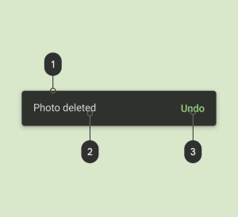

A snackbar which uses:
- **1**: Inverse Surface for its background
- **2**: Inverse On Surface for its text
- **3**: Inverse Primary for its text button

:::tip
See [inverse color tokens](../system-tokens#inverse).
:::

### Shadows and Scrim colors

:::tip
See [elevation section](./elevation).
:::
