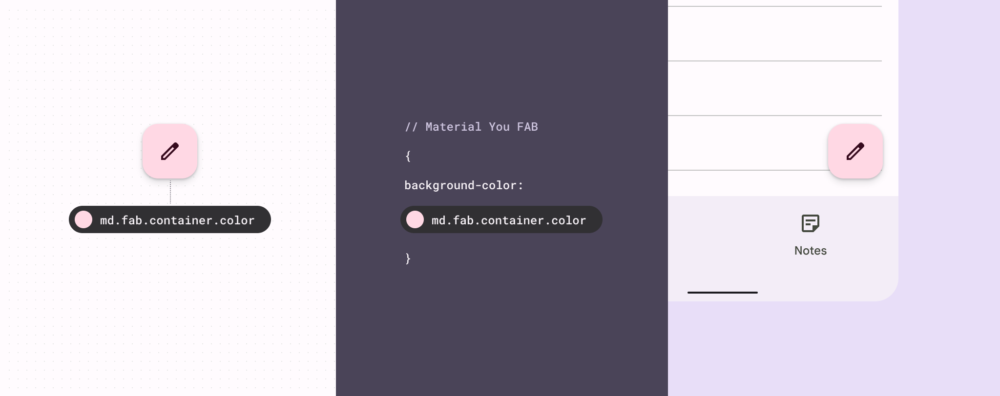
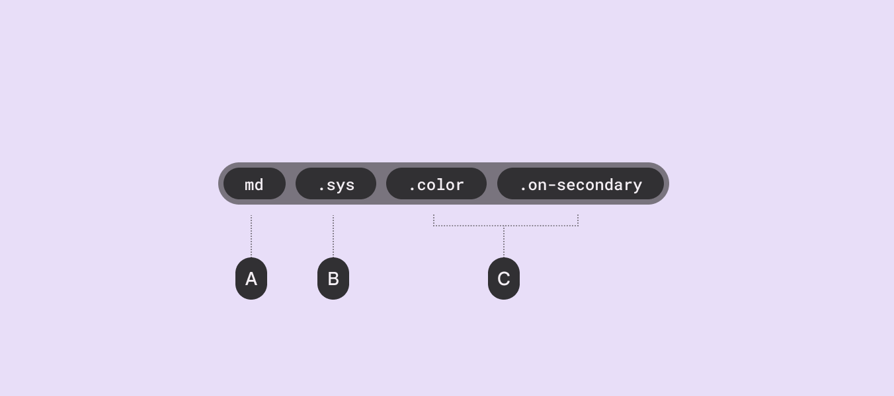

import Figure from '../../src/components/Figure'

# Design Tokens

Design tokens are the building blocks of all UI elements. The same tokens are used in designs, tools, and code.

- Design tokens point to style values like colors, fonts, and measurements
- Use design tokens instead of hardcoded values
- Each token is named for how or where it’s used (ex: ds.fab.container.color sets the container color for a FAB component)
- Even if a token’s end value is changed, its name and use remain the same
- There are three kinds of tokens: [reference](#reference-tokens), [system](#system-tokens), and [component](#component-tokens)

Tokens ensure the same style values are used across design files and code

Using design tokens instead of hardcoded values can streamline the work of building, maintaining, and scaling products with a design system.

## What’s a design token?

Design tokens represent the small, repeated design decisions that make up a design system's visual style. Tokens replace static values, such as hex codes for color, with self-explanatory names.

A Design token consists of 2 parts:
- A code-like name, such as **ds.ref.palette.secondary90**
- An associated value, such as **#E8DEF8**

<Figure
    src={require('./img/design-token-example.png').default}
    alt="Design Token example"
    caption="Example of a reference token and its associated color value"
/>

The token's value can be one of several things: A **color**, a **typeface**, a **measurement**, or even **another token**.

Design tokens meaningfully connect style choices that would otherwise lack a clear relationship.

For example, if a designer's mock-ups and an engineer's implementation both reference the same token called secondary container color, then design and engineering can be confident that the same color will be used in both places. This consistency remains in place even when the color value assigned to a token gets updated.

<Figure
    src={require('./img/example-secondary-container.png').default}
    alt="Design Token in dev and design"
    caption="Diagram of a token assigned to the secondary color of a FAB container and a token assigned to the on-secondary color of its icon"
/>

## Why are Tokens important?

Tokens enable a design system to have a single source of truth. They provide a kind of repository for recording and tracking style choices and changes.

When using tokens for design and implementation, style updates will propagate consistently through an entire product or suite of products.

Because tokens are reusable and purpose-driven, they can define system-wide updates to themes and contexts for use. For example, tokens can be used to systematically apply a high-contrast color scheme for improved visibility, or to change the type scale to make small text legible on a TV.

<Figure
    src={require('./img/tokens-cascade.png').default}
    alt="Design Tokens cascade"
    caption="As design systems evolve, certain values will change. Design tokens help you track changes and ensure ongoing consistency across experiences."
/>

## Reading Tokens names

The parts of a token name are separated by periods and progress from the most general information (ds) to the most specific (onSecondary).

- **A**: All token names in a design system start with the system name, such as ds for Design System
- **B**: An abbreviation for the token type: ref is for reference tokens; sys is for system tokens; comp is for component tokens
- **C**: The token name ends with a descriptive name to communicate the token’s role

## Types of Tokens

There are three kinds of tokens:

- **1 - Reference tokens**: All available tokens with associated values.
- **2 - System tokens**: Decisions and roles that give the design system its character, from color and typography, to elevation and shape.
- **3 - Component tokens**: The design attributes assigned to elements in a component, such as the color of a button icon.

<Figure
    src={require('./img/token-types.png').default}
    alt="Token types"
    caption="Diagram of a button that receives its container color through a system of three tokens that define scalable color values. The color tokens point to a specific hex value that can easily change without impacting the token syntax."
/>

With three kinds of tokens, teams can update design decisions globally or apply a change to a single component.

### Reference Tokens

Reference tokens begin with **ds.ref**.

These tokens comprise all of the style options available in a design system.

They usually point to a static value, such as a hex code for color or font and weight for type. Common uses include:

- Color hex values
- Typefaces
- Font weights

Reference tokens can also point to other reference tokens; they do not change based on user or device contexts.

The list of reference tokens provides a starting point for consistent color, type, measurement, and more.

<Figure
    src={require('./img/reference-tokens.png').default}
    alt="Reference tokens"
    caption="Color and typography reference tokens and their values"
/>

### System Tokens

Subsystem tokens begin with **ds.sys**.

These are the decisions that systematize the design language for a specific theme or context.

System tokens define the purpose that a reference token serves in the UI.

Whenever possible, system tokens should point to reference tokens rather than static values.

<Figure
    src={require('./img/system-tokens.png').default}
    alt="System tokens"
    caption="System tokens, reference tokens, and their values"
/>

### Component Tokens

All component tokens begin with **ds.comp**.

Component tokens represent the elements and values that comprise a component, such as containers, label text, icons, and states.

Whenever possible, component tokens should point to a system or reference token, rather than hard values such as hex codes.

While some component style choices won't be expressed as a token, but a token should be used whenever a design choice applies to multiple components with similar uses.

<Figure
    src={require('./img/component-tokens.png').default}
    alt="Component tokens"
    caption="Component tokens, system tokens, reference tokens, and their values"
/>
