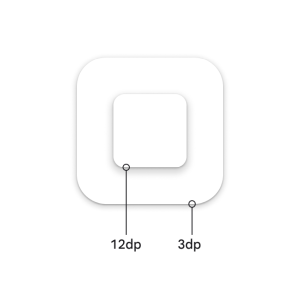
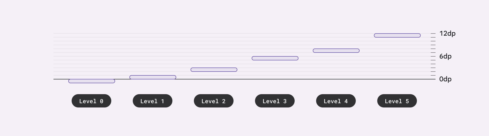
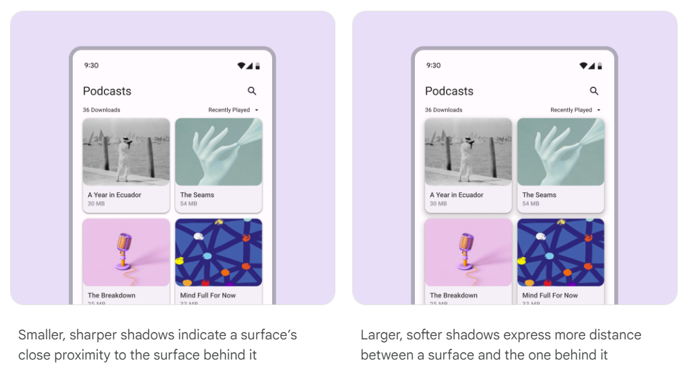

# Elevation

Elevation is measured as the distance between components along the z-axis in density-independent pixels (dps).

## Levels

Elevation system is deliberately limited to just a handful of levels. This creative constraint means you need to make thoughtful decisions about your UI’s elevation story.

Material uses six levels of elevation, each with a corresponding dp value.
These values are named for their relative distance above the UI’s surface: 0, +1, +2, +3, +4, and +5.
An element’s resting state can be on levels 0 to +3, while levels +4 and +5 are reserved for user-interacted states such as hover and dragged (currently not supported).

:::tip
See [elevation level tokens](../system-tokens#elevations).
:::

## Shadows

Shadows can express the degree of elevation between surfaces in ways that other techniques cannot.

Both a shadow’s size and amount of softness or diffusion express the degree of distance between two surfaces. For example, a surface with a shadow that is small and sharp indicates a surface’s close proximity to the surface behind it. Larger, softer shadows express more distance.

When it comes to applying shadows, less is more. The fewer levels in your UI, the more power they have to direct attention and action.

:::tip
See [shadow token](../system-tokens#other).
:::

## Scrims

A scrim can bring focus to specific elements by increasing the visual contrast of a large layered surface. Use the scrim beneath elements like modals and expanded navigation menus.

Scrims use the scrim color role at an opacity of 40%.

Scrims help bring focus to important elements like the navigation drawer and dialogs.

:::tip
See [scrim token](../system-tokens#other).
:::