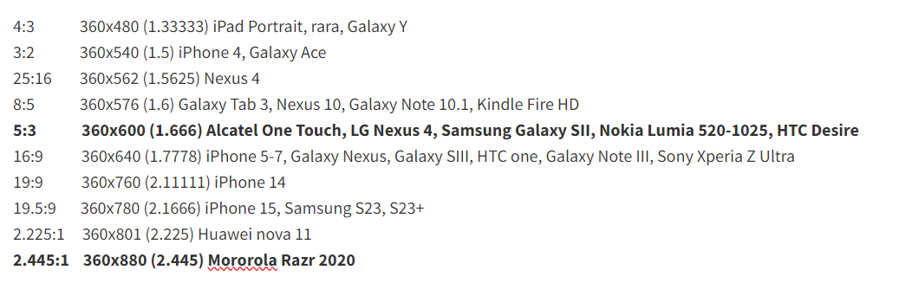
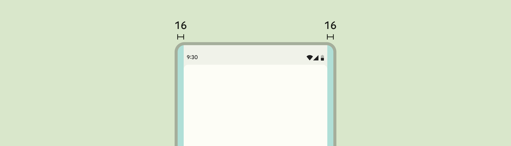
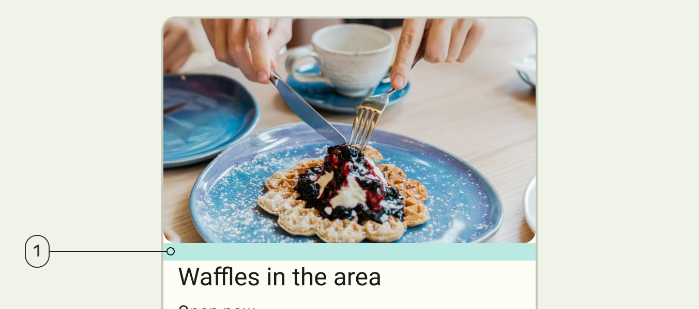

# Layout

The Design System currently support mobile devices only.

## Units

The width of reference used in Figma for the designs is **360dp**.

All the units are converted proportionally to this width. For example: if the width of the real device is 720dp and we have in Figma
a 10dp padding, it will be converted to 20dp in the real device. This conversion is made in code with the ```rv``` function.

The minimum supported proportional height (proportional to 360dp width) is 600dp and the maximum is 880dp.

This covers a vast range of device resolutions:



The Design token's units in dp correlates to pixels in Figma with a width of 360px.

## Spacing

### Margins

Margins are the spaces between the edge of a window area and the elements within that window area.

Margins are **16dp** from the left and right edge of the window.



### Padding

Padding refers to the space between UI elements. Padding can be measured vertically and horizontally and does not need to span the entire height or width of a layout. Padding is measured in increments of **4dp**.



When multiple elements are stacked vertically within a component, use 4dp increments to separate them. Center the grouped element within the component container.


