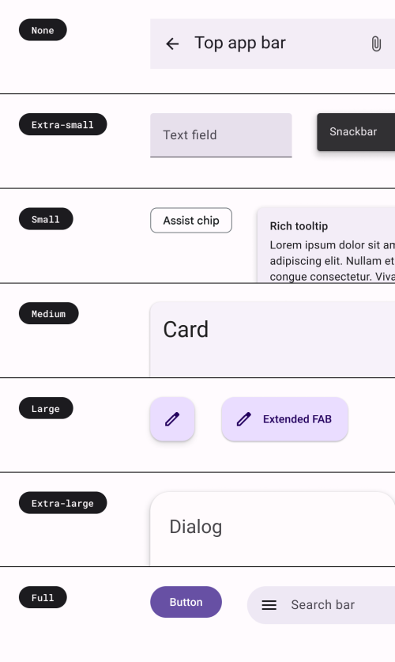

# Shape

The shape system uses a size-based scale with seven styles. Styles are assigned to components based on the desired amount
of roundedness. For rounded corners, square-cornered shapes are “none” and slightly rounded shapes are "extra-small",
while entirely rounded shapes are "full".

:::tip
See [shape tokens](../system-tokens#shapes).
:::

