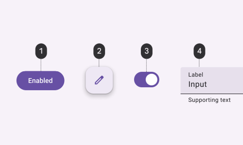
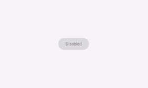
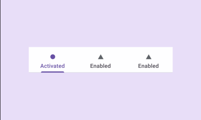
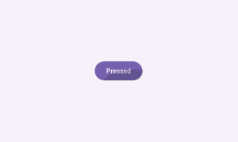
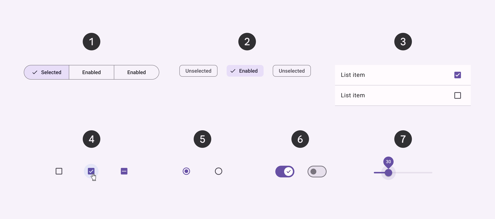
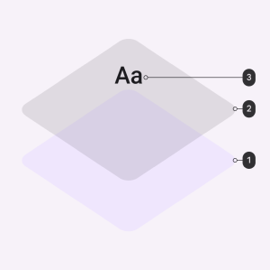

# States

## Types

### Enabled

An enabled state communicates an interactive component or element. Enabled states use the default styling for each interactive component.

### Disabled

A disabled state, also known as an inoperable state, communicates when a component or element isn’t interactive. Inoperable states are deemphasized by reducing the enabled state to 38% opacity.

Inoperable states can also indicate they are not interactive through color changes and reduced elevation.

**Disabled and inoperable states do not need to meet contrast requirements.**

Inoperable components can’t be focused, dragged, or pressed and don’t change state when tapped.

### Activated

Activated states indicate which item from a set of options is currently being viewed. They are initiated either by default or user choice, using input methods such as a tap, cursor, keyboard, or voice input.

Activated states are higher emphasis and signified by an overlay, color change, or other visual treatments applied to elements or segments within a component.

An activated state differs from a selected state because it communicates a highlighted destination.

Within a single set of options, only one activated state may be present at a time.

### Pressed

A pressed state communicates a user-initiated tap or voice input. This state applies to all interactive components.

Pressed states trigger a change in composition and should be high-emphasis.

An overlay signifies a pressed state. It can be applied to an entire component or elements within a component, or as a circular shape over part of the component.

Pressed states can be combined with activated, or selected states.

### Selected

Selections are displayed using a check mark icon, a checkbox component, a change in surface color, or a combination.

## State Layer

A state layer is a semi-transparent covering on an element that indicates its state. State layers provide a systematic approach to visualizing states by using opacity. Only one state layer can be applied at a given time.

To transition from an enabled style to a stateful style requires the addition of a state layer.

The state layer is an overlay with a fixed opacity for each state and uses the same color as the content.

For example, if the enabled style uses secondary container color for the container and on-secondary container for content, the state layer will be an overlay using the on-secondary container color.

If the enabled style uses the surface role for the container and the primary color role for content, then the state layer will be an overlay using the primary color.

- **1**: Container
- **2**: State layer
- **3**: Content

:::tip
See [state layer tokens](../system-tokens#states).
:::

### “On” colors

By default, a component’s state layer color is derived from its content, either the color of an icon or label text if no icon is present.

An on color is a color role used by the content. Each container color has its own corresponding on color.

For example, if a container color is secondary container, the content will use the on secondary container color role.

## Activated and Selected States

Unlike pressed state that use state layers, the container and content of activated and selected components change color directly.

Activated components use the secondary container color for the component container and change the content color to on-secondary container.

