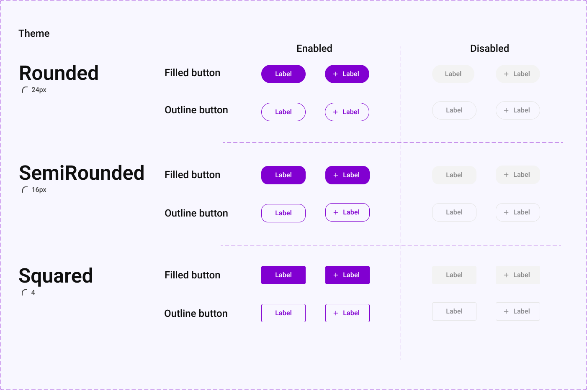

# Themes

The Design System supports 3 different themes:
- Squared _(default)_
- Rounded _(not implemented yet)_
- SemiRounded _(not implemented yet)_

The only thing that changes between themes is the rounding of certain components.

