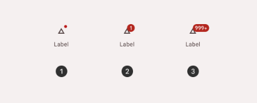

import TokenTable from '../../src/components/TokenTable'
import Token from '../../src/components/Token'
import Details from '@theme/Details'

# Badge

- **1**: Small badge
- **2**: Large badge
- **3**: Large badge with max characters

## Specs

    
Container

    <TokenTable>
        <Token name="ds.comp.badge.smallSize" value="18dp" />
        <Token name="ds.comp.badge.largeSize" value="32dp" />
        <Token name="ds.comp.badge.color" value="ds.sys.color.error" />
        <Token name="ds.comp.badge.shape" value="ds.sys.shape.full" />
    </TokenTable>

    
Label

    <TokenTable>
        <Token name="ds.comp.badge.labelTextColor" value="ds.sys.color.onError" />
        <Token name="ds.comp.badge.labelTextLineHeight" value="ds.sys.typeScale.labelSmall.lineHeight" />
        <Token name="ds.comp.badge.labelTextSize" value="ds.sys.typeScale.labelSmall.fontSize" />
    </TokenTable>

