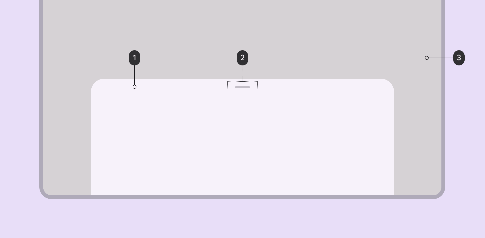

import TokenTable from '../../src/components/TokenTable'
import Token from '../../src/components/Token'
import Details from '@theme/Details'

# Bottom sheet

- **1**: Container
- **2**: Drag handle
- **3**: Scrim

## Specs

    
Container

    <TokenTable>
        <Token name="ds.comp.bottomSheet.containerShape" value="ds.sys.shape.corner.large" />
        <Token name="ds.comp.bottomSheet.containerElevation" value="ds.sys.elevation.level1" />
        <Token name="ds.comp.bottomSheet.containerColor" value="ds.sys.color.surfaceContainer" />
    </TokenTable>

    
Drag Handle

    <TokenTable>
        <Token name="ds.comp.bottomSheet.dragHandleColor" value="ds.sys.color.onSurfaceVariant" />
        <Token name="ds.comp.bottomSheet.dragHandleOpacity" value="0.4" />
        <Token name="ds.comp.bottomSheet.dragHandleWidth" value="32dp" />
        <Token name="ds.comp.bottomSheet.dragHandleHeight" value="4dp" />
        <Token name="ds.comp.bottomSheet.dragHandlePaddingVertical" value="22dp" />
    </TokenTable>

    
Scrim

    <TokenTable>
        <Token name="ds.comp.bottomSheet.scrimColor" value="ds.sys.color.scrim" />
        <Token name="ds.comp.bottomSheet.scrimOpacity" value="0.4" />
    </TokenTable>

