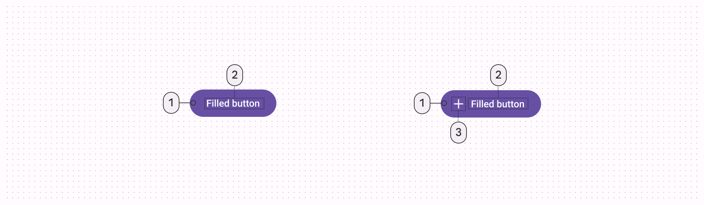
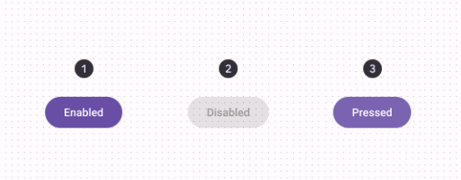

import TokenTable from '../../../src/components/TokenTable'
import Token from '../../../src/components/Token'
import PropsTable from '../../../src/components/PropsTable'
import Prop from '../../../src/components/Prop'
import Details from '@theme/Details'

# Filled Button


- **1**: Container
- **2**: Label
- **3**: Icon (optional)

## States



- **1**: Enabled
- **2**: Disabled
- **3**: Pressed

## Specs

### Enabled

<Details open>
    <summary>Container</summary>
    <TokenTable>
        <Token name="ds.comp.filledButton.containerShape" value="ds.sys.shape.corner.extraSmall" />
        <Token name="ds.comp.filledButton.containerPaddingVertical" value="10dp" />
        <Token name="ds.comp.filledButton.containerPaddingHorizontal" value="12dp" />
        <Token name="ds.comp.filledButton.containerGap" value="8dp" />
        <Token name="ds.comp.filledButton.containerColor" value="ds.sys.color.primary" />
    </TokenTable>
</Details>
<Details open>
    <summary>Label</summary>
    <TokenTable>
        <Token name="ds.comp.filledButton.labelTypeScale" value="ds.sys.typeScale.labelLarge" />
        <Token name="ds.comp.filledButton.labelColor" value="ds.sys.color.onPrimary" />
    </TokenTable>
</Details>
<Details open>
    <summary>Icon</summary>
    <TokenTable>
        <Token name="ds.comp.filledButton.iconSize" value="18dp" />
        <Token name="ds.comp.filledButton.iconColor" value="ds.sys.color.onPrimary" />
    </TokenTable>
</Details>

### Disabled

<Details open>
    <summary>Container</summary>
    <TokenTable>
        <Token name="ds.comp.filledButton.disabledContainerColor" value="ds.sys.color.onSurface" />
        <Token name="ds.comp.filledButton.disabledContainerOpacity" value="ds.sys.state.disabledContainerOpacity" />
    </TokenTable>
</Details>
<Details open>
    <summary>Label</summary>
    <TokenTable>
        <Token name="ds.comp.filledButton.disabledLabelColor" value="ds.sys.color.onSurface" />
        <Token name="ds.comp.filledButton.disabledLabelOpacity" value="ds.sys.state.disabledOnContainerOpacity" />
    </TokenTable>
</Details>
<Details open>
    <summary>Icon</summary>
    <TokenTable>
        <Token name="ds.comp.filledButton.disabledIconColor" value="ds.sys.color.onSurface" />
        <Token name="ds.comp.filledButton.disabledIconOpacity" value="ds.sys.state.disabledOnContainerOpacity" />
    </TokenTable>
</Details>

### Pressed

<Details open>
    <summary>State Layer</summary>
    <TokenTable>
        <Token name="ds.comp.filledButton.pressedStateLayerColor" value="ds.sys.color.onPrimary" />
        <Token name="ds.comp.filledButton.pressedStateLayerOpacity" value="ds.sys.state.pressedStateLayerOpacity" />
    </TokenTable>
</Details>
<Details open>
    <summary>Label</summary>
    <TokenTable>
        <Token name="ds.comp.filledButton.pressedLabelColor" value="ds.sys.color.onPrimary" />
    </TokenTable>
</Details>
<Details open>
    <summary>Icon</summary>
    <TokenTable>
        <Token name="ds.comp.filledButton.pressedIconColor" value="ds.sys.color.onPrimary" />
    </TokenTable>
</Details>

## React Native

```typescript jsx
<FilledButton title="My Button" icon="search" />
```

### Props

<PropsTable>
    <Prop name="title" type="string" />
    <Prop name="icon" type="IconNames" isOptional={true} />
    <Prop name="onPress" type="(event: GestureResponderEvent) => void" isOptional={true} />
    <Prop name="disabled" type="boolean" isOptional={true} />
</PropsTable>
