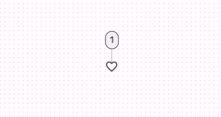

import TokenTable from '../../../src/components/TokenTable'
import Token from '../../../src/components/Token'
import PropsTable from '../../../src/components/PropsTable'
import Prop from '../../../src/components/Prop'
import Details from '@theme/Details'

# Standard Icon Button



## States


- **1**: Enabled
- **2**: Disabled
- **3**: Pressed

## Specs

### Enabled

<Details open>
    <summary>Icon</summary>
    <TokenTable>
        <Token name="ds.comp.standardIconButton.iconSize" value="24dp" />
        <Token name="ds.comp.standardIconButton.iconColor" value="ds.sys.color.onSurface" />
    </TokenTable>
</Details>
<Details open>
    <summary>State Layer</summary>
    <TokenTable>
        <Token name="ds.comp.standardIconButton.stateLayerShape" value="ds.sys.shape.corner.full" />
        <Token name="ds.comp.standardIconButton.stateLayerWidth" value="40dp" />
        <Token name="ds.comp.standardIconButton.stateLayerHeight" value="40dp" />
    </TokenTable>
</Details>

### Disabled

<Details open>
    <summary>Icon</summary>
    <TokenTable>
        <Token name="ds.comp.standardIconButton.disabledIconColor" value="ds.sys.color.onSurface" />
        <Token name="ds.comp.standardIconButton.disabledIconOpacity" value="ds.sys.state.disabledOnContainerOpacity" />
    </TokenTable>
</Details>

### Pressed

<Details open>
    <summary>State Layer</summary>
    <TokenTable>
        <Token name="ds.comp.standardIconButton.pressedStateLayerColor" value="ds.sys.color.onSurface" />
        <Token name="ds.comp.standardIconButton.pressedStateLayerOpacity" value="ds.sys.state.pressedStateLayerOpacity" />
    </TokenTable>
</Details>
<Details open>
    <summary>Icon</summary>
    <TokenTable>
        <Token name="ds.comp.textButton.pressedIconColor" value="ds.sys.color.onSurface" />
    </TokenTable>
</Details>

## React Native

```typescript jsx
<StandardIconButton name="search" />
```

### Props

<PropsTable>
    <Prop name="name" type="IconNames" />
    <Prop name="onPress" type="(event: GestureResponderEvent) => void" isOptional={true} />
    <Prop name="disabled" type="boolean" isOptional={true} />
</PropsTable>
