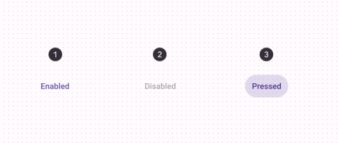

import TokenTable from '../../../src/components/TokenTable'
import Token from '../../../src/components/Token'
import PropsTable from '../../../src/components/PropsTable'
import Prop from '../../../src/components/Prop'
import Details from '@theme/Details'

# Text Button


- **1**: Label
- **2**: Icon (optional)

## States



- **1**: Enabled
- **2**: Disabled
- **3**: Pressed

## Specs

### Enabled

<Details open>
    <summary>Container</summary>
    <TokenTable>
        <Token name="ds.comp.textButton.containerShape" value="ds.sys.shape.corner.extraSmall" />
        <Token name="ds.comp.textButton.containerPaddingVertical" value="10dp" />
        <Token name="ds.comp.textButton.containerPaddingHorizontal" value="12dp" />
        <Token name="ds.comp.textButton.containerGap" value="8dp" />
    </TokenTable>
</Details>
<Details open>
    <summary>Label</summary>
    <TokenTable>
        <Token name="ds.comp.textButton.labelTypeScale" value="ds.sys.typeScale.labelLarge" />
        <Token name="ds.comp.textButton.labelColor" value="ds.sys.color.primary" />
    </TokenTable>
</Details>
<Details open>
    <summary>Icon</summary>
    <TokenTable>
        <Token name="ds.comp.textButton.iconSize" value="18dp" />
        <Token name="ds.comp.textButton.iconColor" value="ds.sys.color.primary" />
    </TokenTable>
</Details>

### Disabled

<Details open>
    <summary>Label</summary>
    <TokenTable>
        <Token name="ds.comp.textButton.disabledLabelColor" value="ds.sys.color.onSurface" />
        <Token name="ds.comp.textButton.disabledLabelOpacity" value="ds.sys.state.disabledOnContainerOpacity" />
    </TokenTable>
</Details>
<Details open>
    <summary>Icon</summary>
    <TokenTable>
        <Token name="ds.comp.textButton.disabledIconColor" value="ds.sys.color.onSurface" />
        <Token name="ds.comp.textButton.disabledIconOpacity" value="ds.sys.state.disabledOnContainerOpacity" />
    </TokenTable>
</Details>

### Pressed

<Details open>
    <summary>State Layer</summary>
    <TokenTable>
        <Token name="ds.comp.textButton.pressedStateLayerColor" value="ds.sys.color.primary" />
        <Token name="ds.comp.textButton.pressedStateLayerOpacity" value="ds.sys.state.pressedStateLayerOpacity" />
    </TokenTable>
</Details>
<Details open>
    <summary>Label</summary>
    <TokenTable>
        <Token name="ds.comp.textButton.pressedLabelColor" value="ds.sys.color.primary" />
    </TokenTable>
</Details>
<Details open>
    <summary>Icon</summary>
    <TokenTable>
        <Token name="ds.comp.textButton.pressedIconColor" value="ds.sys.color.primary" />
    </TokenTable>
</Details>

## React Native

```typescript jsx
<TextButton title="My Button" icon="search" />
```

### Props

<PropsTable>
    <Prop name="title" type="string" />
    <Prop name="icon" type="IconNames" isOptional={true} />
    <Prop name="onPress" type="(event: GestureResponderEvent) => void" isOptional={true} />
    <Prop name="disabled" type="boolean" isOptional={true} />
</PropsTable>
