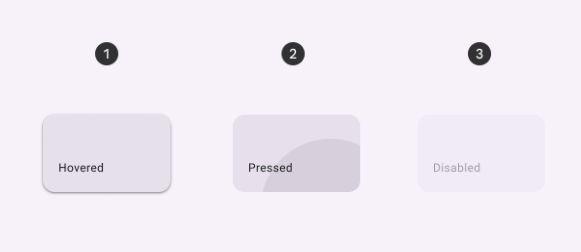

import TokenTable from '../../src/components/TokenTable'
import Token from '../../src/components/Token'
import PropsTable from '../../src/components/PropsTable'
import Prop from '../../src/components/Prop'
import Details from '@theme/Details'

# Card


- **1**: Container

Use a card to display content and actions on a single topic.

Cards should be easy to scan for relevant and actionable information. Elements like text and images should be placed on cards in a way that clearly indicates hierarchy.

Cards can serve as entry points into deeper levels of detail or navigation, such as a music album or Details on an upcoming vacation.

Cards can be displayed together in a grid, vertical list, or carousel.


## States



- **1**: Enabled
- **2**: Pressed
- **3**: Disabled

## Specs

### Enabled

<Details open>
    <summary>Container</summary>
    <TokenTable>
        <Token name="ds.comp.card.containerOutlineColor" value="ds.sys.color.outlineVariant" />
        <Token name="ds.comp.card.containerOutlineWidth" value="0dp" />
        <Token name="ds.comp.card.containerColor" value="ds.sys.color.surfaceContainer" />
        <Token name="ds.comp.card.containerElevation" value="ds.sys.elevation.level2" />
        <Token name="ds.comp.card.containerShape" value="ds.sys.shape.corner.extraSmall" />
        <Token name="ds.comp.card.containerPaddingVertical" value="16dp" />
        <Token name="ds.comp.card.containerPaddingHorizontal" value="16dp" />
    </TokenTable>
</Details>

### Pressed
<Details open>
    <summary>State Layer</summary>
    <TokenTable>
        <Token name="ds.comp.card.pressedStateLayerColor" value="ds.sys.color.onSurface" />
        <Token name="ds.comp.card.pressedStateLayerOpacity" value="ds.sys.state.pressedStateLayerOpacity" />
    </TokenTable>
</Details>

### Disabled

<Details open>
    <summary>Container</summary>
    <TokenTable>
        <Token name="ds.comp.card.disabledContainerElevation" value="ds.sys.elevation.level0" />
        <Token name="ds.comp.card.disabledContainerColor" value="ds.sys.color.surfaceContainer" />
        <Token name="ds.comp.card.disabledContainerOpacity" value="ds.sys.state.disabledContainerOpacity" />
        <Token name="ds.comp.card.disabledContainerOutlineColor" value="ds.sys.color.onSurface" />
        <Token name="ds.comp.card.disabledContainerOutlineOpacity" value="ds.sys.state.disabledContainerOpacity" />
    </TokenTable>
</Details>

## React Native

```typescript jsx
<Card>
    // ... content
</Card>
```

### Props
<PropsTable>
    <Prop name="style" type="ViewStyle" isOptional={true} />
    <Prop name="onPress" type="(event: GestureResponderEvent) => void" isOptional={true} />
    <Prop name="disabled" type="boolean" isOptional={true} />
</PropsTable>
