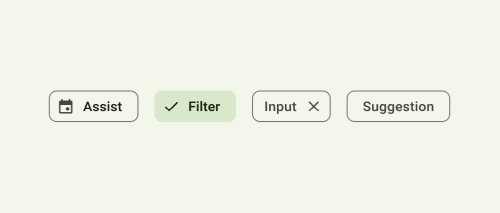
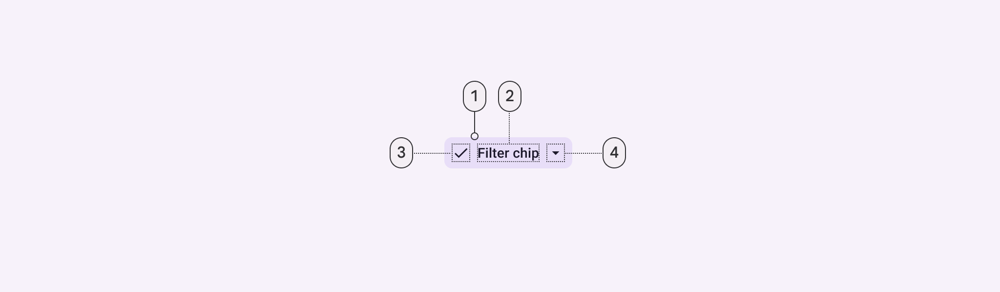
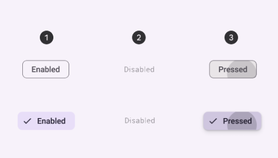

import Tabs from '@theme/Tabs'
import TabItem from '@theme/TabItem'
import Details from '@theme/Details'
import TokenTable from '../../src/components/TokenTable'
import Token from '../../src/components/Token'
import PropsTable from '../../src/components/PropsTable'
import Prop from '../../src/components/Prop'

# Chip



Chips allow users to enter information, make selections, filter content, or trigger actions. While buttons are expected to appear consistently and with familiar calls to action, chips should appear dynamically as a group of multiple interactive elements.

Chips and buttons are similar in that they both provide visual cues to prompt users to take actions and make selections. However, there are important distinctions to be aware of.

Multiple chips should appear together in a group, whereas there should be no more than 3 buttons in a single arrangement.

## Types of chips

There are 4 types of chips:
- **Assist**: represent smart or automated actions that can span multiple apps, such as opening a calendar event from the home screen. Assist chips function as though the user asked an assistant to complete the action. They should appear dynamically and contextually in a UI.
- **Filter**: Filter chips use tags or descriptive words to filter content. They can be a good alternative to toggle buttons or checkboxes. They can also be used for selecting options.
- **Input**: Input chips represent discrete pieces of information entered by a user, such as Gmail contacts or filter options within a search field.
- **Suggestion**: Suggestion chips help narrow a user’s intent by presenting dynamically generated suggestions, such as possible responses or search filters.

:::tip
See [official guidelines](https://m3.material.io/components/chips/guidelines) for more info.
:::

## Parts


- **1**: Container
- **2**: Label
- **3**: Leading icon (optional)
- **4**: Trailing icon (optional)

## States



- **1**: Enabled (unselected and selected)
- **2**: Disabled
- **3**: Pressed (unselected and selected)

## Specs

### Enabled Unselected

<Tabs groupId="themes">
    <TabItem value="squared" label="Squared Theme (default)" default>
        <Details open>
            <summary>Container</summary>
            <TokenTable>
                <Token name="ds.comp.chip.containerColor" value="transparent" />
                <Token name="ds.comp.chip.containerElevation" value="ds.sys.elevation.level0" />
                <Token name="ds.comp.chip.containerOutlineColor" value="ds.sys.color.outlineVariant" />
                <Token name="ds.comp.chip.containerOutlineWidth" value="1dp" />
                <Token name="ds.comp.chip.containerShape" value="ds.sys.shape.corner.small" />
                <Token name="ds.comp.chip.containerPaddingVertical" value="6dp" />
                <Token name="ds.comp.chip.containerPaddingHorizontal" value="16dp" />
                <Token name="ds.comp.chip.containerGap" value="8dp" />
            </TokenTable>
        </Details>
        <Details open>
            <summary>Label</summary>
            <TokenTable>
                <Token name="ds.comp.chip.labelTypeScale" value="ds.sys.typeScale.labelLarge" />
                <Token name="ds.comp.chip.labelColor" value="ds.sys.color.onSurfaceVariant" />
            </TokenTable>
        </Details>
        <Details open>
            <summary>Icon</summary>
            <TokenTable>
                <Token name="ds.comp.chip.iconSize" value="18dp" />
                <Token name="ds.comp.chip.iconColor" value="ds.sys.color.onSurfaceVariant" />
            </TokenTable>
        </Details>
    </TabItem>
    <TabItem value="rounded" label="Rounded Theme">
        <Details open>
            <summary>Container</summary>
            <TokenTable>
                <Token name="ds.comp.chip.containerColor" value="ds.sys.color.surfaceContainer" />
                <Token name="ds.comp.chip.containerElevation" value="ds.sys.elevation.level0" />
                <Token name="ds.comp.chip.containerOutlineColor" value="ds.sys.color.outlineVariant" />
                <Token name="ds.comp.chip.containerOutlineWidth" value="1dp" />
                <Token name="ds.comp.chip.containerShape" value="ds.sys.shape.corner.full" />
                <Token name="ds.comp.chip.containerPaddingVertical" value="6dp" />
                <Token name="ds.comp.chip.containerPaddingHorizontal" value="8dp" />
                <Token name="ds.comp.chip.containerGap" value="8dp" />
            </TokenTable>
        </Details>
        <Details open>
            <summary>Label</summary>
            <TokenTable>
                <Token name="ds.comp.chip.labelTypeScale" value="ds.sys.typeScale.labelLarge" />
                <Token name="ds.comp.chip.labelColor" value="ds.sys.color.onSurfaceVariant" />
            </TokenTable>
        </Details>
        <Details open>
            <summary>Icon</summary>
            <TokenTable>
                <Token name="ds.comp.chip.iconSize" value="18dp" />
                <Token name="ds.comp.chip.iconColor" value="ds.sys.color.onSurfaceVariant" />
            </TokenTable>
        </Details>
    </TabItem>
</Tabs>

### Enabled selected

<Details open>
    <summary>Container</summary>
    <TokenTable>
        <Token name="ds.comp.chip.selectedContainerColor" value="ds.sys.color.primaryContainer" />
        <Token name="ds.comp.chip.selectedContainerOutlineColor" value="ds.sys.color.primary" />
        <Token name="ds.comp.chip.selectedContainerOutlineWidth" value="1dp" />
    </TokenTable>
</Details>
<Details open>
    <summary>Label</summary>
    <TokenTable>
        <Token name="ds.comp.chip.selectedLabelColor" value="ds.sys.color.onPrimaryContainer" />
    </TokenTable>
</Details>
<Details open>
    <summary>Icon</summary>
    <TokenTable>
        <Token name="ds.comp.chip.selectedIconColor" value="ds.sys.color.onPrimaryContainer" />
    </TokenTable>
</Details>

### Disabled

<Details open>
    <summary>Container</summary>
    <TokenTable>
        <Token name="ds.comp.chip.disabledContainerColor" value="ds.sys.color.onSurface" />
        <Token name="ds.comp.chip.disabledContainerOpacity" value="ds.sys.state.disabledContainerOpacity" />
        <Token name="ds.comp.chip.disabledContainerOutlineColor" value="ds.sys.color.onSurface" />
        <Token name="ds.comp.chip.disabledContainerOutlineOpacity" value="ds.sys.state.disabledContainerOpacity" />
    </TokenTable>
</Details>
<Details open>
    <summary>Label</summary>
    <TokenTable>
        <Token name="ds.comp.chip.disabledLabelColor" value="ds.sys.color.onSurface" />
        <Token name="ds.comp.chip.disabledLabelOpacity" value="ds.sys.state.disabledOnContainerOpacity" />
    </TokenTable>
</Details>
<Details open>
    <summary>Icon</summary>
    <TokenTable>
        <Token name="ds.comp.chip.disabledIconColor" value="ds.sys.color.onSurface" />
        <Token name="ds.comp.chip.disabledIconOpacity" value="ds.sys.state.disabledOnContainerOpacity" />
    </TokenTable>
</Details>

### Pressed unselected

<Details open>
    <summary>State Layer</summary>
    <TokenTable>
        <Token name="ds.comp.chip.pressedStateLayerColor" value="ds.sys.color.onSurfaceVariant" />
        <Token name="ds.comp.chip.pressedStateLayerOpacity" value="ds.sys.state.pressedStateLayerOpacity" />
    </TokenTable>
</Details>
<Details open>
    <summary>Label</summary>
    <TokenTable>
        <Token name="ds.comp.chip.pressedLabelColor" value="ds.sys.color.onSurfaceVariant" />
    </TokenTable>
</Details>
<Details open>
    <summary>Icon</summary>
    <TokenTable>
        <Token name="ds.comp.chip.pressedIconColor" value="ds.sys.color.onSurfaceVariant" />
    </TokenTable>
</Details>

### Pressed selected

<Details open>
    <summary>State Layer</summary>
    <TokenTable>
        <Token name="ds.comp.chip.pressedSelectedStateLayerColor" value="ds.sys.color.onPrimaryContainer" />
        <Token name="ds.comp.chip.pressedSelectedStateLayerOpacity" value="ds.sys.state.pressedStateLayerOpacity" />
    </TokenTable>
</Details>
<Details open>
    <summary>Label</summary>
    <TokenTable>
        <Token name="ds.comp.chip.pressedSelectedLabelColor" value="ds.sys.color.onPrimaryContainer" />
    </TokenTable>
</Details>
<Details open>
    <summary>Icon</summary>
    <TokenTable>
        <Token name="ds.comp.chip.pressedSelectedIconColor" value="ds.sys.color.onPrimaryContainer" />
    </TokenTable>
</Details>

## React Native

```typescript jsx
<Chip title="My Chip" />
```

### Props
<PropsTable>
    <Prop name="title" type="string" />
    <Prop name="leadingIcon" type="IconNames" isOptional={true} />
    <Prop name="trailingIcon" type="IconNames" isOptional={true} />
    <Prop name="onPress" type="(event: GestureResponderEvent) => void" isOptional={true} />
    <Prop name="selected" type="boolean" isOptional={true} />
    <Prop name="disabled" type="boolean" isOptional={true} />
</PropsTable>
