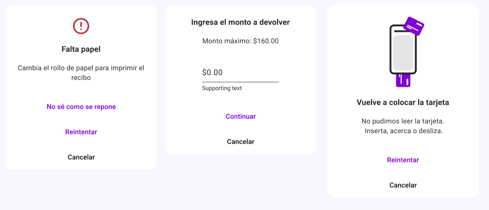

import Details from '@theme/Details'
import TokenTable from '../../src/components/TokenTable'
import Token from '../../src/components/Token'
import PropsTable from '../../src/components/PropsTable'
import Prop from '../../src/components/Prop'


# Dialog



- Container
- Content Container
- Buttons Container
- Scrim

## Specs

<Details open>
    <summary>Container</summary>
    <TokenTable>
        <Token name="ds.comp.dialog.containerShape" value="ds.sys.shape.corner.large" />
        <Token name="ds.comp.dialog.containerColor" value="ds.sys.color.surfaceContainer" />
    </TokenTable>
</Details>
<Details open>
    <summary>Content Container</summary>
    <TokenTable>
        <Token name="ds.comp.dialog.contentContainerPaddingHorizontal" value="24dp" />
        <Token name="ds.comp.dialog.contentContainerPaddingVertical" value="24dp" />
    </TokenTable>
</Details>
<Details open>
    <summary>Buttons Container</summary>
    <TokenTable>
        <Token name="ds.comp.dialog.buttonsContainerPaddingHorizontal" value="24dp" />
        <Token name="ds.comp.dialog.buttonsContainerPaddingVertical" value="16dp" />
        <Token name="ds.comp.dialog.buttonsContainerGap" value="8dp" />
    </TokenTable>
</Details>
<Details open>
    <summary>Scrim</summary>
    <TokenTable>
        <Token name="ds.comp.dialog.scrimColor" value="ds.sys.color.scrim" />
        <Token name="ds.comp.dialog.scrimOpacity" value="0.4" />
    </TokenTable>
</Details>

## React Native

```typescript jsx
<Dialog>
    <Dialog.Content>
        // some content...
    </Dialog.Content>
    <Dialog.Button>
        <TextButton title="Continuar" />
        <TextButton title="Cancelar" />
    </Dialog.Button>
</Dialog>
```

### Props

<PropsTable>
    <Prop name="closeOnScrimPress" type="boolean" isOptional={true} />
    <Prop name="onClose" type="() => void" isOptional={true} />
</PropsTable>
