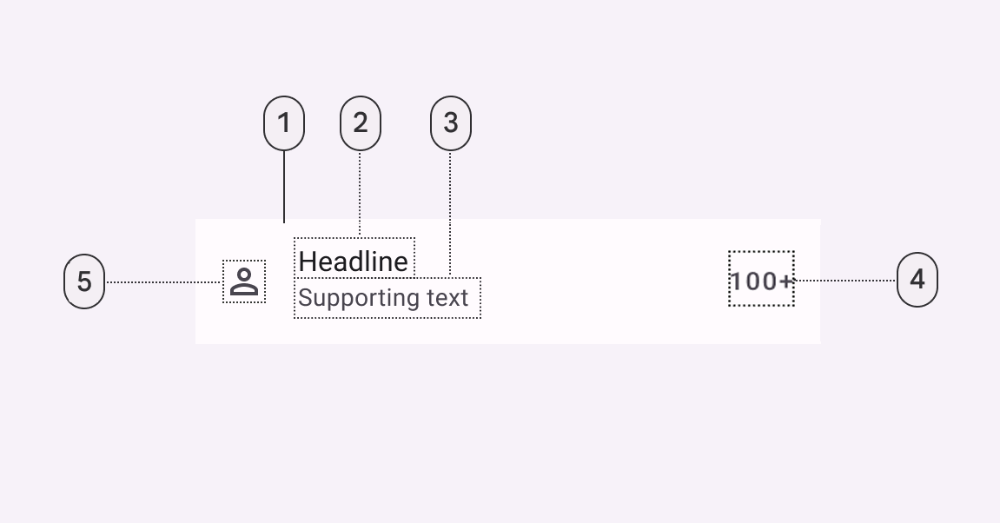
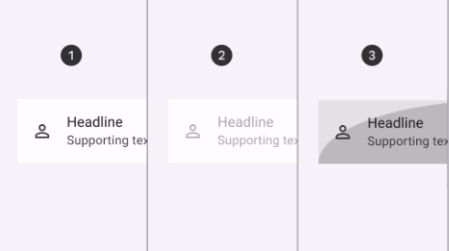

import Details from '@theme/Details'
import TokenTable from '../../src/components/TokenTable'
import Token from '../../src/components/Token'
import PropsTable from '../../src/components/PropsTable'
import Prop from '../../src/components/Prop'

# List item

The Design System uses a modified version of the Material Design List.



- **1**: Container
- **2**: Headline
- **3**: Supporting text (optional). Can span to 2 lines.
- **4**: Trailing Supporting text (optional)
- **5**: Icon (optional)

## States



- **1**: Enabled
- **2**: Disabled
- **3**: Pressed
- **4**: Selected

## Specs

### Enabled

<Details open>
    <summary>Container</summary>
    <TokenTable>
        <Token name="ds.comp.listItem.containerOutlineColor" value="ds.sys.color.outlineVariant" />
        <Token name="ds.comp.listItem.containerOutlineWidth" value="1dp" />
        <Token name="ds.comp.listItem.containerShape" value="ds.sys.shape.corner.extraSmall" />
        <Token name="ds.comp.listItem.containerHeight" value="56dp" />
        <Token name="ds.comp.listItem.containerPaddingHorizontal" value="10dp" />
        <Token name="ds.comp.listItem.containerGap" value="10dp" />
        <Token name="ds.comp.listItem.containerColor" value="ds.sys.color.surfaceContainer" />
    </TokenTable>
</Details>
<Details open>
    <summary>Headline</summary>
    <TokenTable>
        <Token name="ds.comp.listItem.headlineTypeScale" value="ds.sys.typeScale.bodyMedium" />
        <Token name="ds.comp.listItem.headlineColor" value="ds.sys.color.onSurface" />
    </TokenTable>
</Details>
<Details open>
    <summary>Supporting text</summary>
    <TokenTable>
        <Token name="ds.comp.listItem.supportingTextTypeScale" value="ds.sys.typeScale.bodySmall" />
        <Token name="ds.comp.listItem.supportingTextColor" value="ds.sys.color.onSurfaceVariant" />
    </TokenTable>
</Details>
<Details open>
    <summary>Icon</summary>
    <TokenTable>
        <Token name="ds.comp.listItem.iconSize" value="24dp" />
        <Token name="ds.comp.listItem.iconColor" value="ds.sys.color.onSurface" />
    </TokenTable>
</Details>
<Details open>
    <summary>Trailing supporting text</summary>
    <TokenTable>
        <Token name="ds.comp.listItem.trailingSupportingTextTypeScale" value="ds.sys.typeScale.titleSmall" />
        <Token name="ds.comp.listItem.trailingSupportingTextColor" value="ds.sys.color.onSurface" />
    </TokenTable>
</Details>

### Disabled

<Details open>
    <summary>Container</summary>
    <TokenTable>
        <Token name="ds.comp.listItem.disabledContainerColor" value="ds.sys.color.onSurface" />
        <Token name="ds.comp.listItem.disabledContainerOpacity" value="ds.sys.state.disabledContainerOpacity" />
        <Token name="ds.comp.listItem.disabledContainerOutlineColor" value="ds.sys.color.onSurface" />
        <Token name="ds.comp.listItem.disabledContainerOutlineOpacity" value="ds.sys.state.disabledContainerOpacity" />
    </TokenTable>
</Details>
<Details open>
    <summary>Headline</summary>
    <TokenTable>
        <Token name="ds.comp.listItem.disabledHeadlineColor" value="ds.sys.color.onSurface" />
        <Token name="ds.comp.listItem.disabledHeadlineOpacity" value="ds.sys.state.disabledOnContainerOpacity" />
    </TokenTable>
</Details>
<Details open>
    <summary>Supporting text</summary>
    <TokenTable>
        <Token name="ds.comp.listItem.disabledSupportingTextColor" value="ds.sys.color.onSurface" />
        <Token name="ds.comp.listItem.disabledSupportingTextOpacity" value="ds.sys.state.disabledOnContainerOpacity" />
    </TokenTable>
</Details>
<Details open>
    <summary>Icon</summary>
    <TokenTable>
        <Token name="ds.comp.listItem.disabledIconColor" value="ds.sys.color.onSurface" />
        <Token name="ds.comp.listItem.disabledIconOpacity" value="ds.sys.state.disabledOnContainerOpacity" />
    </TokenTable>
</Details>
<Details open>
    <summary>Trailing supporting text</summary>
    <TokenTable>
        <Token name="ds.comp.listItem.disabledTrailingSupportingTextColor" value="ds.sys.color.onSurface" />
        <Token name="ds.comp.listItem.disabledTrailingSupportingTextOpacity" value="ds.sys.state.disabledOnContainerOpacity" />
    </TokenTable>
</Details>

### Pressed

<Details open>
    <summary>State Layer</summary>
    <TokenTable>
        <Token name="ds.comp.listItem.pressedStateLayerColor" value="ds.sys.color.onSurface" />
        <Token name="ds.comp.listItem.pressedStateLayerOpacity" value="ds.sys.state.pressedStateLayerOpacity" />
    </TokenTable>
</Details>
<Details open>
    <summary>Headline</summary>
    <TokenTable>
        <Token name="ds.comp.listItem.pressedHeadlineColor" value="ds.sys.color.onSurface" />
    </TokenTable>
</Details>
<Details open>
    <summary>Supporting text</summary>
    <TokenTable>
        <Token name="ds.comp.listItem.pressedSupportingTextColor" value="ds.sys.color.onSurfaceVariant" />
    </TokenTable>
</Details>
<Details open>
    <summary>Icon</summary>
    <TokenTable>
        <Token name="ds.comp.listItem.pressedIconColor" value="ds.sys.color.onSurface" />
    </TokenTable>
</Details>
<Details open>
    <summary>Trailing supporting text</summary>
    <TokenTable>
        <Token name="ds.comp.listItem.pressedTrailingSupportingTextColor" value="ds.sys.color.onSurface" />
    </TokenTable>
</Details>

### Selected

<Details open>
    <summary>State Layer</summary>
    <TokenTable>
        <Token name="ds.comp.listItem.selectedStateLayerColor" value="ds.sys.color.onPrimaryContainer" />
        <Token name="ds.comp.listItem.selectedStateLayerOpacity" value="ds.sys.state.pressedStateLayerOpacity" />
    </TokenTable>
</Details>


## React Native

```typescript jsx
<ListItem headline="Visa**4567" icon="check_circle" supportingText="15 de julio" trailingSupportingText="$ 1,615.00" />
```

### Props

<PropsTable>
    <Prop name="headline" type="string" />
    <Prop name="icon" type="IconNames" isOptional={true} />
    <Prop name="supportingText" type="string" isOptional={true} />
    <Prop name="trailingSupportingText" type="string" isOptional={true} />
    <Prop name="onPress" type="(event: GestureResponderEvent) => void" isOptional={true} />
    <Prop name="disabled" type="boolean" isOptional={true} />
    <Prop name="iconStyle" type="TextStyle" isOptional={true} />
    <Prop name="headlineTextStyle" type="TextStyle" isOptional={true} />
    <Prop name="supportingTextStyle" type="TextStyle" isOptional={true} />
    <Prop name="trailingSupportingTextStyle" type="TextStyle" isOptional={true} />
</PropsTable>
