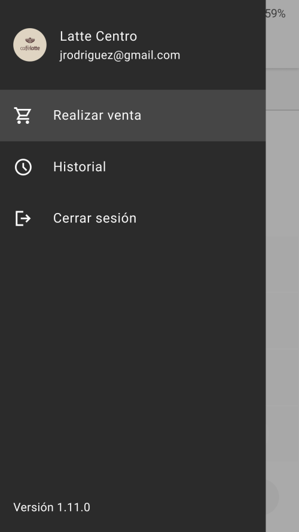

import Details from '@theme/Details'
import TokenTable from '../../src/components/TokenTable'
import Token from '../../src/components/Token'

# Navigation drawer

- **1**: Container
- **2**: User Container
- **2**: User Avatar
- **3**: User Label
- **4**: User Supporting Text
- **5**: Item Container
- **6**: Item Icon
- **7**: Item Label
- **8**: Supporting Text (eg: app version number)
- **9**: Scrim

## Specs

### Enabled

    
Container

    <TokenTable>
        <Token name="ds.comp.navigationDrawer.containerWidth" value="280dp" />
        <Token name="ds.comp.navigationDrawer.containerElevation" value="ds.sys.elevation.level0" />
        <Token name="ds.comp.navigationDrawer.containerColor" value="ds.sys.color.inverseSurface" />
    </TokenTable>

    
User Container

    <TokenTable>
        <Token name="ds.comp.navigationDrawer.userContainerColor" value="ds.sys.color.inverseSurface" />
        <Token name="ds.comp.navigationDrawer.userContainerPaddingVertical" value="32dp" />
        <Token name="ds.comp.navigationDrawer.userContainerPaddingHorizontal" value="16dp" />
        <Token name="ds.comp.navigationDrawer.userContainerGap" value="16dp" />
    </TokenTable>

    
User Avatar

    <TokenTable>
        <Token name="ds.comp.navigationDrawer.userAvatarSize" value="40dp" />
    </TokenTable>

    
User Label

    <TokenTable>
        <Token name="ds.comp.navigationDrawer.userLabelTypeScale" value="ds.sys.typeScale.titleMedium" />
        <Token name="ds.comp.navigationDrawer.userLabelColor" value="ds.sys.color.inverseOnSurface" />
    </TokenTable>

    
User Supporting Text

    <TokenTable>
        <Token name="ds.comp.navigationDrawer.userSupportingTextTypeScale" value="ds.sys.typeScale.bodyMedium" />
        <Token name="ds.comp.navigationDrawer.userSupportingTextColor" value="ds.sys.color.inverseOnSurface" />
    </TokenTable>

    
Item Container

    <TokenTable>
        <Token name="ds.comp.navigationDrawer.itemContainerColor" value="ds.sys.color.inverseSurface" />
        <Token name="ds.comp.navigationDrawer.itemContainerHeight" value="62dp" />
        <Token name="ds.comp.navigationDrawer.itemContainerPaddingHorizontal" value="16dp" />
        <Token name="ds.comp.navigationDrawer.itemContainerGap" value="24dp" />
    </TokenTable>

    
Item Icon

    <TokenTable>
        <Token name="ds.comp.navigationDrawer.itemIconSize" value="24dp" />
        <Token name="ds.comp.navigationDrawer.itemIconColor" value="ds.sys.color.inverseOnSurface" />
    </TokenTable>

    
Item Label

    <TokenTable>
        <Token name="ds.comp.navigationDrawer.itemLabelTypeScale" value="ds.sys.typeScale.bodyLarge" />
        <Token name="ds.comp.navigationDrawer.itemLabelColor" value="ds.sys.color.inverseOnSurface" />
    </TokenTable>

    
Supporting text

    <TokenTable>
        <Token name="ds.comp.navigationDrawer.supportingTextTypeScale" value="ds.sys.typeScale.bodyMedium" />
        <Token name="ds.comp.navigationDrawer.supportingTextColor" value="ds.sys.color.inverseOnSurface" />
    </TokenTable>

    
Scrim

    <TokenTable>
        <Token name="ds.comp.navigationDrawer.scrimColor" value="ds.sys.color.scrim" />
        <Token name="ds.comp.navigationDrawer.scrimOpacity" value="0.4" />
    </TokenTable>

### Item Active

    
Item Container

    <TokenTable>
        <Token name="ds.comp.navigationDrawer.activeItemContainerColor" value="ds.ref.palette.neutral30" />
    </TokenTable>

    
Item Icon

    <TokenTable>
        <Token name="ds.comp.navigationDrawer.activeItemIconColor" value="ds.sys.color.inverseOnSurface" />
    </TokenTable>

    
Item Label

    <TokenTable>
        <Token name="ds.comp.navigationDrawer.activeItemLabelColor" value="ds.sys.color.inverseOnSurface" />
    </TokenTable>

### Item Pressed

    
State Layer

    <TokenTable>
        <Token name="ds.comp.navigationDrawer.pressedStateLayerColor" value="ds.sys.color.inverseOnSurface" />
        <Token name="ds.comp.navigationDrawer.pressedStateLayerOpacity" value="ds.sys.state.pressedStateLayerOpacity" />
    </TokenTable>

    
Item Icon

    <TokenTable>
        <Token name="ds.comp.navigationDrawer.pressedItemIconColor" value="ds.sys.color.inverseOnSurface" />
    </TokenTable>

    
Item Label

    <TokenTable>
        <Token name="ds.comp.navigationDrawer.pressedItemLabelColor" value="ds.sys.color.inverseOnSurface" />
    </TokenTable>

