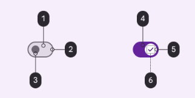
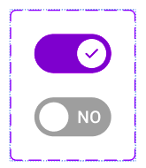

import TokenTable from '../../src/components/TokenTable'
import Token from '../../src/components/Token'
import PropsTable from '../../src/components/PropsTable'
import Prop from '../../src/components/Prop'
import Details from '@theme/Details'

# Switch



- **1**: Surface Container
- **2**: Outline
- **3**: Outline
- **4**: Primary
- **5**: On primary
- **6**: On primary container

Switches toggle the selection of an item on or off

Use switches (not radio buttons) if the items in a list can be independently controlled

Switches are the best way to let users adjust settings

Make sure the switch’s selection (on or off) is visible at a glance


## States



- **1**: Enabled
- **2**: Disabled

## Specs

### Enabled

<Details open>
    <summary>Container</summary>
    <TokenTable>
        <Token name="ds.comp.switch.trackColor" value="ds.sys.color.primary" />
        <Token name="ds.comp.switch.handleColor" value="ds.sys.color.surfaceContainer" />
        <Token name="ds.comp.switch.iconColor" value="ds.sys.color.primary" />
    </TokenTable>
</Details>


### Disabled

<Details open>
    <summary>Container</summary>
    <TokenTable>
        <Token name="ds.comp.switch.trackColor" value="ds.ref.palette.neutral._70" />
        <Token name="ds.comp.switch.handleColor" value="ds.sys.color.surfaceContainer" />
        <Token name="ds.comp.switch.textColor" value="ds.sys.color.surfaceContainer" />
    </TokenTable>
</Details>

## React Native

```typescript jsx
<Switch value={boolean} onValueChange={() => boolean} disabled={boolean} />
```

### Props
<PropsTable>
    <Prop name="value" type="boolean" isOptional={false} />
    <Prop name="onValueChange" type="(event: GestureResponderEvent) => void" isOptional={true} />
    <Prop name="disabled" type="boolean" isOptional={true} />
</PropsTable>
