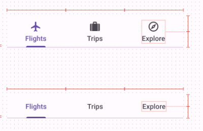
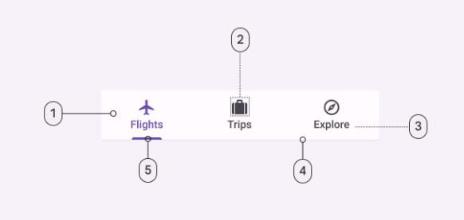

import Details from '@theme/Details'
import TokenTable from '../../src/components/TokenTable'
import Token from '../../src/components/Token'

# Tabs

- **1**: Container
- **2**: Icon (optional)
- **3**: Label
- **4**: Divider
- **4**: Active indicator

## Specs

### Enabled

    
Container

    <TokenTable>
        <Token name="ds.comp.tabs.containerShape" value="ds.sys.shape.corner.none" />
        <Token name="ds.comp.tabs.containerColor" value="ds.sys.color.surfaceContainer" />
        <Token name="ds.comp.tabs.containerElevation" value="ds.sys.elevation.level0" />
    </TokenTable>

    
Icon

    <TokenTable>
        <Token name="ds.comp.tabs.iconSize" value="24dp" />
    </TokenTable>

    
Label

    <TokenTable>
        <Token name="ds.comp.tabs.labelTypeScale" value="ds.sys.typeScale.titleSmall" />
        <Token name="ds.comp.tabs.labelInactiveColor" value="ds.sys.color.onSurfaceVariant" />
        <Token name="ds.comp.tabs.labelActiveColor" value="ds.sys.color.primary" />
    </TokenTable>

    
Divider

    <TokenTable>
        <Token name="ds.comp.tabs.dividerThickness" value="1dp" />
        <Token name="ds.comp.tabs.dividerColor" value="ds.sys.color.outlineVariant" />
    </TokenTable>

    
Active Indicator

    <TokenTable>
        <Token name="ds.comp.tabs.activeIndicatorColor" value="ds.sys.color.primary" />
        <Token name="ds.comp.tabs.activeIndicatorHeight" value="3dp" />
    </TokenTable>

### Pressed

    
State Layer

    <TokenTable>
        <Token name="ds.comp.tabs.pressedStateLayerColor" value="ds.sys.color.primary" />
        <Token name="ds.comp.tabs.pressedStateLayerOpacity" value="ds.sys.state.pressedStateLayerOpacity" />
    </TokenTable>

