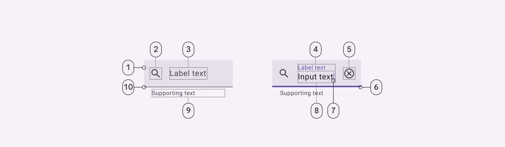
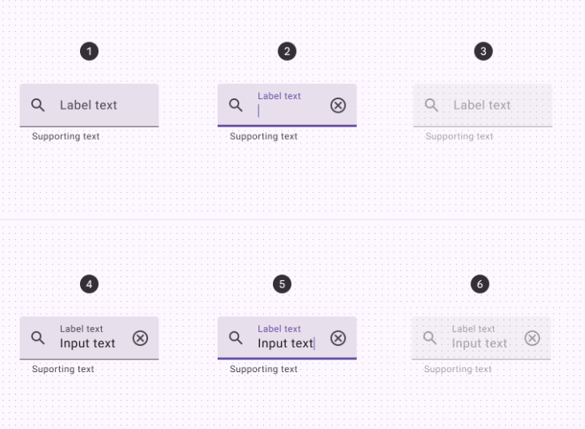
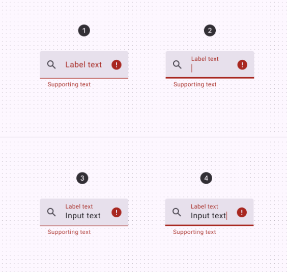

import TokenTable from '../../../src/components/TokenTable'
import Token from '../../../src/components/Token'
import Details from '@theme/Details'

# Filled Text Field

- **1**: Container
- **2**: Leading icon (optional)
- **3**: Label text (empty)
- **4**: Label text (populated)
- **5**: Trailing icon (optional)
- **6**: Active Indicator (focused)
- **7**: Caret
- **8**: Input text
- **9**: Supporting text (optional)
- **10**: Active Indicator (enabled)

## States

- **1**: Enabled (empty)
- **2**: Focused (empty)
- **3**: Disabled (empty)
- **4**: Enabled (populated)
- **5**: Focused (populated)
- **6**: Disabled (populated)

### Error States

- **1**: Enabled (empty)
- **2**: Focused (empty)
- **3**: Enabled (populated)
- **4**: Focused (populated)

## Specs

### Enabled

    
Container

    <TokenTable>
        <Token name="ds.comp.filledTextField.containerPaddingVertical" value="8dp" />
        <Token name="ds.comp.filledTextField.containerPaddingHorizontal" value="12dp" />
        <Token name="ds.comp.filledTextField.containerGap" value="16dp" />
    </TokenTable>

    
Leading icon

    <TokenTable>
        <Token name="ds.comp.filledTextField.leadingIconSize" value="24dp" />
        <Token name="ds.comp.filledTextField.leadingIconColor" value="ds.sys.color.onSurfaceVariant" />
    </TokenTable>

    
Label

    <TokenTable>
        <Token name="ds.comp.filledTextField.labelTypeScale" value="ds.sys.typeScale.bodySmall" />
        <Token name="ds.comp.filledTextField.labelColor" value="ds.sys.color.onSurfaceVariant" />
    </TokenTable>

    
Trailing icon

    <TokenTable>
        <Token name="ds.comp.filledTextField.trailingIconSize" value="24dp" />
        <Token name="ds.comp.filledTextField.trailingIconColor" value="ds.sys.color.onSurfaceVariant" />
    </TokenTable>

    
Active indicator

    <TokenTable>
        <Token name="ds.comp.filledTextField.activeIndicatorHeight" value="1dp" />
        <Token name="ds.comp.filledTextField.activeIndicatorColor" value="ds.sys.color.onSurfaceVariant" />
    </TokenTable>

    
Caret

    <TokenTable>
        <Token name="ds.comp.filledTextField.caretColor" value="ds.sys.color.primary" />
    </TokenTable>

    
Input text

    <TokenTable>
        <Token name="ds.comp.filledTextField.inputTextTypeScale" value="ds.sys.typeScale.bodyLarge" />
        <Token name="ds.comp.filledTextField.inputTextColor" value="ds.sys.color.onSurface" />
    </TokenTable>

    
Supporting text

    <TokenTable>
        <Token name="ds.comp.filledTextField.supportingTextTypeScale" value="ds.sys.typeScale.bodySmall" />
        <Token name="ds.comp.filledTextField.supportingTextColor" value="ds.sys.color.onSurfaceVariant" />
    </TokenTable>

### Focused

    
Label

    <TokenTable>
        <Token name="ds.comp.filledTextField.focusedLabelColor" value="ds.sys.color.primary" />
    </TokenTable>

    
Active indicator

    <TokenTable>
        <Token name="ds.comp.filledTextField.focusedActiveIndicatorHeight" value="2dp" />
        <Token name="ds.comp.filledTextField.focusedActiveIndicatorColor" value="ds.sys.color.primary" />
    </TokenTable>

### Disabled

    
Leading icon

    <TokenTable>
        <Token name="ds.comp.filledTextField.disabledLeadingIconColor" value="ds.sys.color.onSurface" />
        <Token name="ds.comp.filledTextField.disabledLeadingIconOpacity" value="ds.sys.state.disabledOnContainerOpacity" />
    </TokenTable>

    
Label

    <TokenTable>
        <Token name="ds.comp.filledTextField.disabledLabelColor" value="ds.sys.color.onSurface" />
        <Token name="ds.comp.filledTextField.disabledLabelOpacity" value="ds.sys.state.disabledOnContainerOpacity" />
    </TokenTable>

    
Trailing icon

    <TokenTable>
        <Token name="ds.comp.filledTextField.disabledTrailingIconColor" value="ds.sys.color.onSurface" />
        <Token name="ds.comp.filledTextField.disabledTrailingIconOpacity" value="ds.sys.state.disabledOnContainerOpacity" />
    </TokenTable>

    
Active indicator

    <TokenTable>
        <Token name="ds.comp.filledTextField.disabledActiveIndicatorColor" value="ds.sys.color.onSurface" />
        <Token name="ds.comp.filledTextField.disabledActiveIndicatorOpacity" value="ds.sys.state.disabledOnContainerOpacity" />
    </TokenTable>

    
Input text

    <TokenTable>
        <Token name="ds.comp.filledTextField.disabledInputTextColor" value="ds.sys.color.onSurface" />
        <Token name="ds.comp.filledTextField.disabledInputTextOpacity" value="ds.sys.state.disabledOnContainerOpacity" />
    </TokenTable>

    
Supporting text

    <TokenTable>
        <Token name="ds.comp.filledTextField.disabledSupportingTextColor" value="ds.sys.color.onSurface" />
        <Token name="ds.comp.filledTextField.disabledSupportingTextOpacity" value="ds.sys.state.disabledOnContainerOpacity" />
    </TokenTable>

### Error

    
Label

    <TokenTable>
        <Token name="ds.comp.filledTextField.errorLabelColor" value="ds.sys.color.error" />
    </TokenTable>

    
Trailing icon

    <TokenTable>
        <Token name="ds.comp.filledTextField.errorTrailingIconColor" value="ds.sys.color.error" />
    </TokenTable>

    
Active indicator

    <TokenTable>
        <Token name="ds.comp.filledTextField.errorActiveIndicatorColor" value="ds.sys.color.error" />
    </TokenTable>

    
Supporting text

    <TokenTable>
        <Token name="ds.comp.filledTextField.errorSupportingTextColor" value="ds.sys.color.error" />
    </TokenTable>

