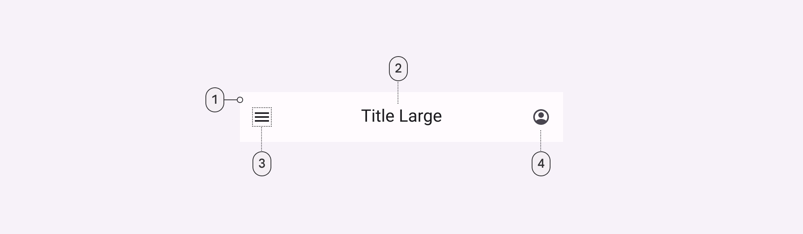

import Details from '@theme/Details'
import TokenTable from '../../src/components/TokenTable'
import Token from '../../src/components/Token'

# Top app bar

The Design System uses only the Center Aligned Material Design Top app bar.

- **1**: Container
- **2**: Headline
- **3**: Leading standard icon button (optional)
- **4**: Trailing standard icon button (optional)
- **4**: Text Button (optional)

## Specs

    
Container

    <TokenTable>
        <Token name="ds.comp.topAppBar.containerColor" value="ds.sys.color.surfaceContainer" />
        <Token name="ds.comp.topAppBar.containerElevation" value="ds.sys.elevation.level3" />
        <Token name="ds.comp.topAppBar.containerHeight" value="64dp" />
        <Token name="ds.comp.topAppBar.containerPaddingHorizontal" value="16dp" />
        <Token name="ds.comp.topAppBar.containerGap" value="24dp" />
    </TokenTable>

    
Headline

    <TokenTable>
        <Token name="ds.comp.topAppBar.headlineTypeScale" value="ds.sys.typeface.titleMedium" />
        <Token name="ds.comp.topAppBar.headlineColor" value="ds.sys.color.onSurface" />
    </TokenTable>

    
Leading Standard Icon Button

    <TokenTable>
        <Token name="ds.comp.topAppBar.leadingIconButtonColor" value="ds.sys.color.onSurface" />
    </TokenTable>

